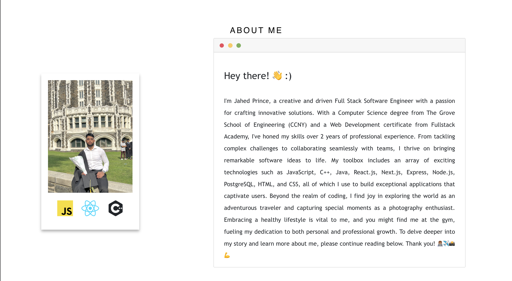

<h2>Jahed's Portfolio</h2>

<strong>:crown: advantages</strong>

 &nbsp;  &nbsp;  &nbsp;  &nbsp; 

 

<h3>:eye_speech_bubble: Live demo</h3>

Check live demonstration <a href="https://jahedprince.github.io/Portfolio/"><strong>here</strong></a>

<h3>:star: Inspirations</h3>

<a href="https://github.com/stephane-monnot/react-vertical-timeline">React Vertical Timeline</a>  
<a href="https://github.com/rcaferati/react-awesome-slider">React Awesome Slider</a>  
<a href="https://github.com/markusenglund/react-switch">React Switch</a>  
<a href="https://github.com/catalinmiron/react-typical">React Typical</a>  
<a href="https://iconify.design/icon-sets/?query=angular">Iconify Design</a>  
<a href="https://www.w3docs.com/snippets/css/how-to-create-polaroid-image-with-css.html#">Polaroid effect</a>  
<a href="https://tholman.com/github-corners/">GitHub Ref Corner</a>
